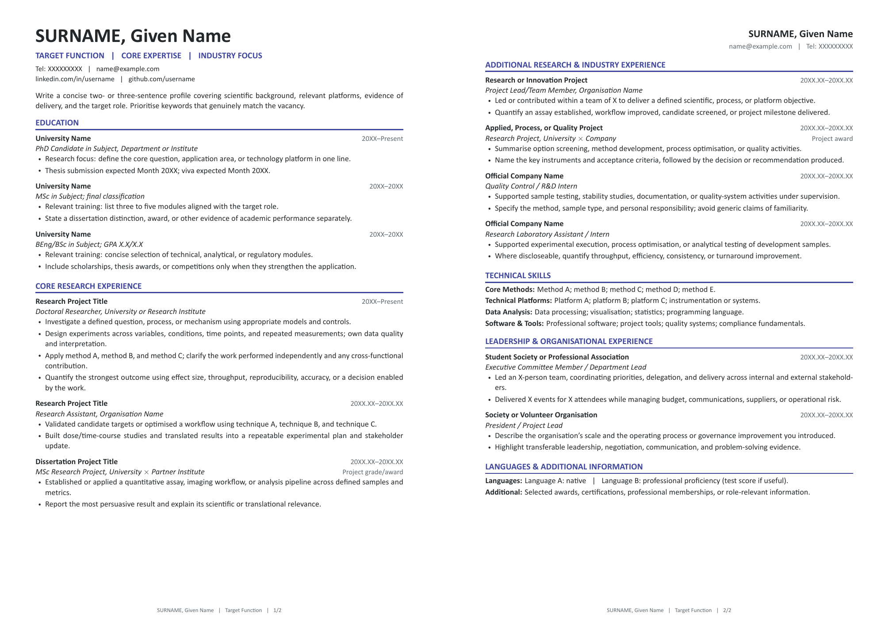
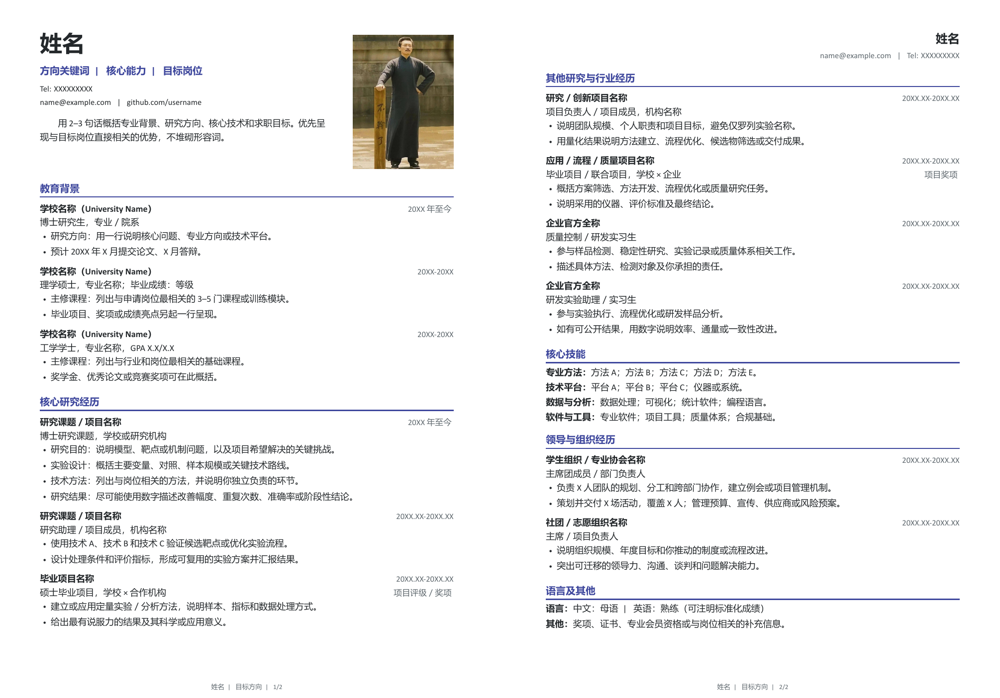

# LaTeX CV Templates

Two clean, two-page A4 CV templates written independently for Chinese and English professional contexts. Both templates use a single-column layout, searchable PDF text, restrained colour styling, and structured sections for education, research, technical skills, and leadership experience.

## Previews

### English template

[](examples/English_CV_Template.pdf)

### Chinese template

[](examples/Chinese_CV_Template.pdf)

Click either preview to open the corresponding example PDF.

## Files

- `Chinese_CV_Template.tex` — Chinese two-page CV with an optional profile photo.
- `English_CV_Template.tex` — English two-page CV without a photo.
- `鲁迅.jpeg` — placeholder photo used by the Chinese template; replace it with your own image.
- `previews/` — README preview images.
- `examples/` — compiled example PDFs.

## Requirements

- A TeX distribution with XeLaTeX
- Calibri
- Microsoft YaHei for the Chinese template

If these fonts are unavailable, replace the `\setmainfont` and `\setCJKmainfont` declarations with installed alternatives.

## Compile

From the repository root, run:

```bash
xelatex Chinese_CV_Template.tex
xelatex English_CV_Template.tex
```

Compile each document twice if cross-references or PDF metadata need refreshing. Generated auxiliary files are ignored by Git.

## Customise

Replace the example names, contact details, dates, institutions, projects, skills, and quantified outcomes with verified information. For the Chinese template, replace `鲁迅.jpeg` or update the `\includegraphics` path. Keep the documents at 11 pt and rebalance content before reducing font size.

## Author

[**PlutaB**](https://github.com/PlutaB)

## License

Copyright © 2026 PlutaB.

Licensed under the [MIT License](LICENSE).
